# UC13_CodificarAplicacoesDispositivosMoveis
UC13: Codificar aplicações para dispositivos móveis.

# Instalação e configuração

Vamos instalar a interface para poder utilizar o emulado.

- Quando abrir vai em **More Actions**

- Selcione a opção **SDK Manager**.

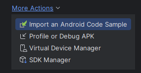

- Selecione a opção do **android 15, na API 35**.

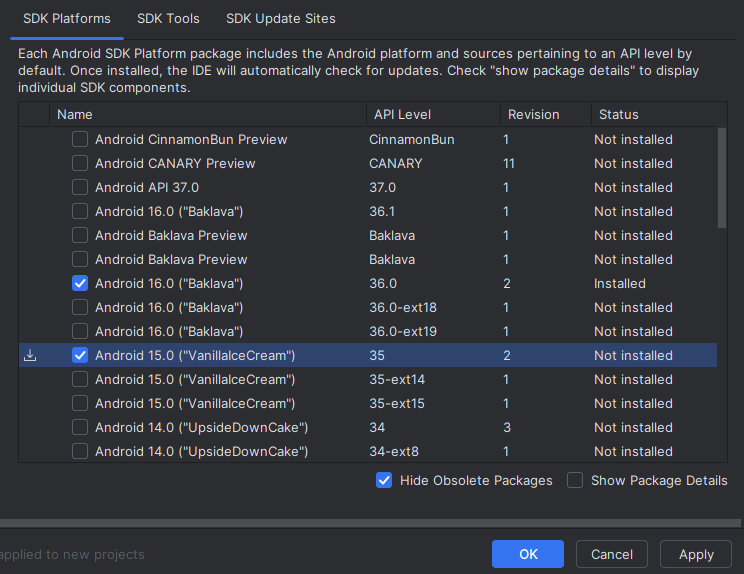

- Da um Finalizar para poder baixar a configuração.

### Depois de Finalizar vamos criar um Máquina Virtual

- Selecione **Virtal Device Manager**.

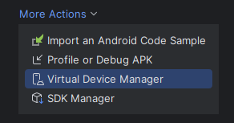

- Clique em criar **Virtual device**.


- Selecione o Phone neste caso que vamos utilizar, e selecione o **PIXEL 7**.


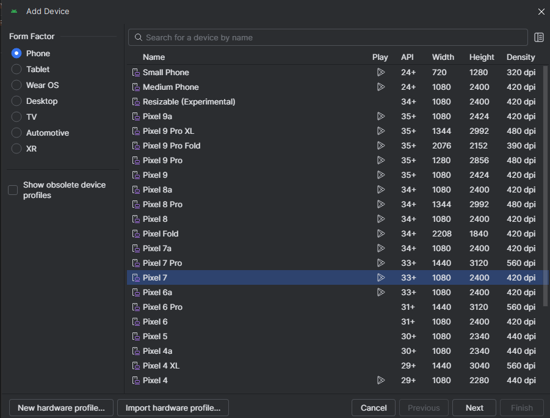

- Selecione o opção **Show Package Detalails**.

- Produre ***Intel x86_64*** e instalar.

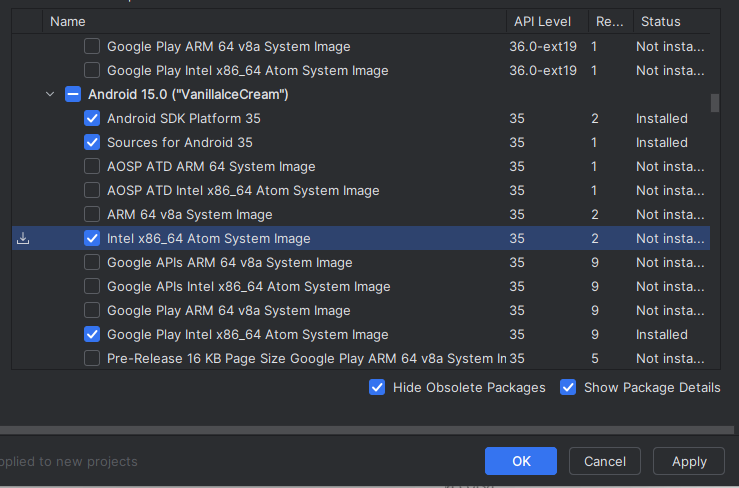

- Na configuração, podemos manter o mesmo nome.

- Mas precisamos trocar API para a instalada o *35*.

- Em Serviços vamos manter como **Google Play Store**.

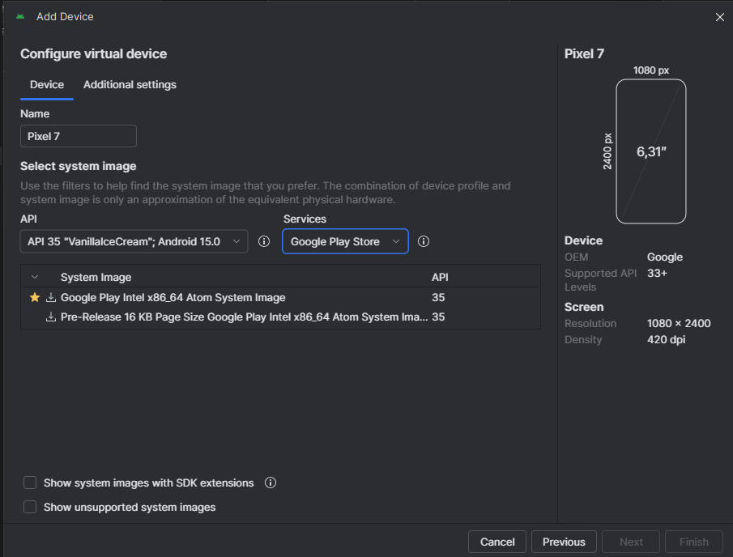

- Vamos baixar a instalação do arquivo selecionado, clique em download.

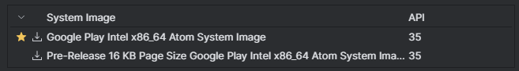

# Rodar comando no CMD.

```sql
setx ANDROID_HOME "%LOCALAPPDATA%\Android\Sdk"
setx PATH "%PATH%;%ANDROID_HOME%\platform-tools;%ANDROID_HOME%\emulator"
```

# Se apresentar erro ao emular.

- Vai na variavel de ambiente, pegar a Andrid e editar.

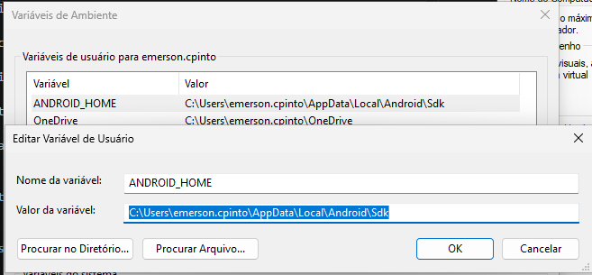

Pega o caminho e abre no windows.

- depois de aberto vai no variavel de ambiente PATH.

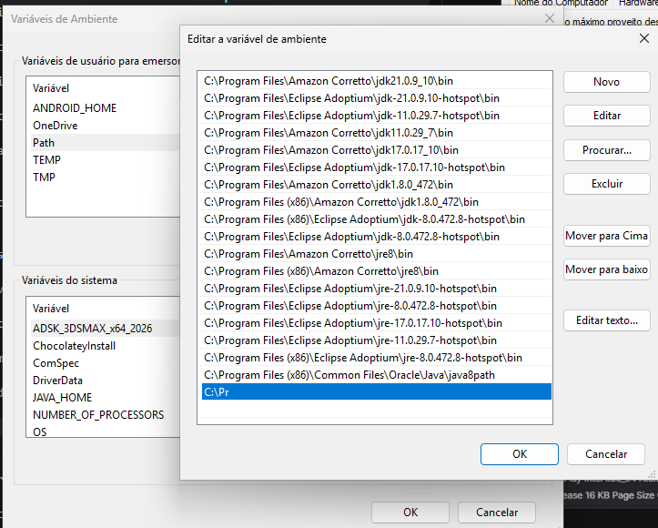

- Pegar o caminho, para poder abrir a pasta do android, e colocar no windows.

- Seleciona o Pr e troca pelo caminho do emulator

C:\Users\emerson.cpinto\AppData\Local\Android\Sdk\emulator

- Depois volta a pasta, para acessar platafomar tools e peguei o caminho e adicone a abaixo. Dar um OK e reinicar o PC.

C:\Users\emerson.cpinto\AppData\Local\Android\Sdk\platform-tools

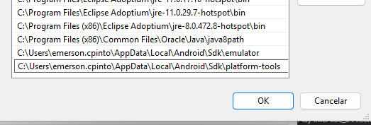

## Configuração para Placa de Vídeo.

- Abrir a maquina virtual, e clica em editar.

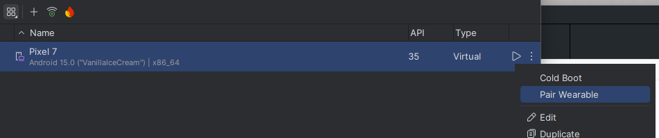

- Vai em **Additional Settings**.

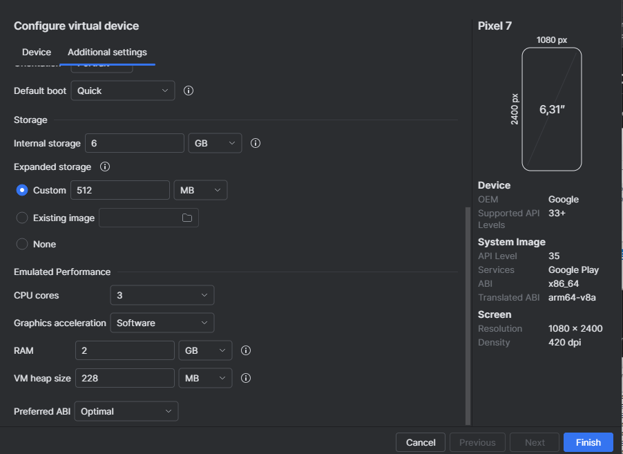

- Produrar por **Emulated Performance**, seleciona **Graphic accelararion** e alterar para ***Software***.

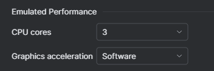


# Configuração do Andriod Studio com o V-Code

- Vamos acessar Varivél de Ambiente.

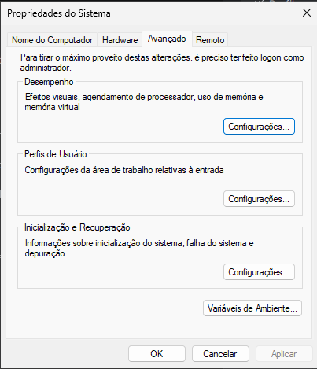

- Clique em Alterar Varivél.

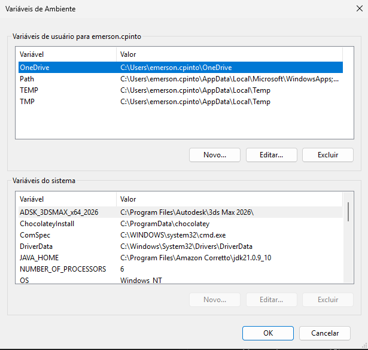

- Poderia dar um novo e cadastrar as Variavél, mas pode tbm rodar os comandos a baixo para poder criar.

***Abri o CMD e executar a baixo***. 

setx ANDROID_HOME "%LOCALAPPDATA%\Android\Sdk"

setx PATH "%PATH%;%ANDROID_HOME%\platform-tools;%ANDROID_HOME%\emulator"

** Abre um novo CMD rodar o comando SET para saber se deu certo e produrar o Android HOME para ver se deu certo

- Vamos clicar em **PLAY** para poder rodar a maquina.

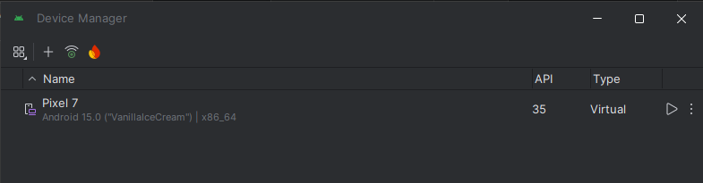