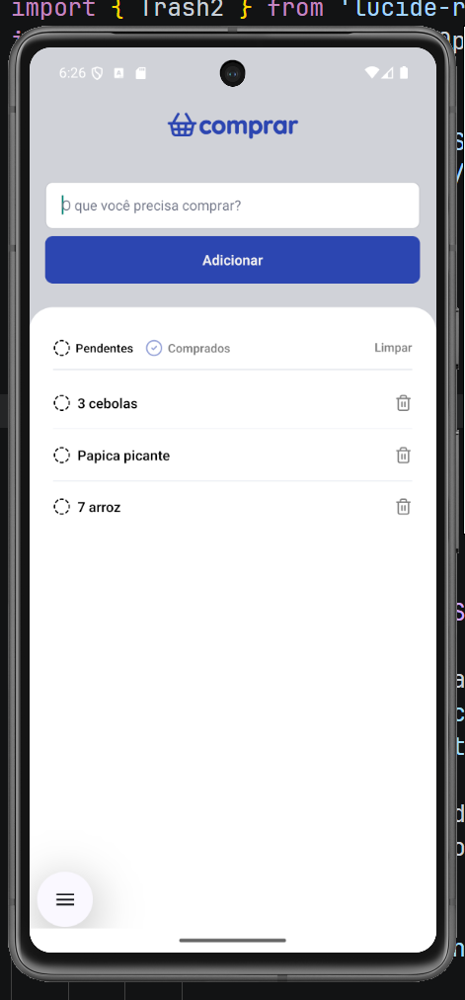

# Projeto lista de compras desenvolvido com a TII02

## comandos essenciais

- iniciar projeto senac!
```cmd
npx expo start --offline
```
- instalando pacotes essenciais
```cmd
npm install
```


## objetivo de hoje!



## Desbloquear powershell para rodar scripts npx/npm
 
TypeScript
```sql
Set-ExecutionPolicy RemoteSigned -Scope CurrentUser
```
 
## comando para desbloquear o expo no terminal é preciso rodar toda vez que abrir o terminal
 
TypeScript
```sql
$env:NODE_TLS_REJECT_UNAUTHORIZED="0"
```

## instalar o async storage
 
TypeScript
```sql
npx expo install @react-native-async-storage/async-storage
```