# React Native - Navigation

 

Antes da gente começar quero deixar registrado aqui que todo o conteúdo foi baseado no terminal do PoweShell devido a algumas limitações de rede interna então vamos configurar ele

habilite a função de desenvolvimento do PoweShell (esse primeiro comando é nescessario executar somente uma vez)

```powershell
Set-ExecutionPolicy RemoteSigned -Scope CurrentUser
```

Para sempre podemos usar durante as aula é preciso sempre ‘ativar’ o terminal para trabalhar então rode no começo da aula sempre

```powershell
$env:NODE_TLS_REJECT_UNAUTHORIZED="0"
```

## Navigator

Nós vamos utilizar o React Navigation (https://reactnavigation.org/), pois ele é a biblioteca de navegação mais popular da comunidade React Native e facilita o gerenciamento de rotas e telas dentro da aplicação.

---

### Tipos de Navegação

#### Stack Navigation

O Stack funciona como uma pilha de telas.

Quando navegamos para uma nova tela, ela é aberta “por cima” da tela anterior, criando a sensação de empilhamento.

Esse tipo de navegação é muito utilizado em aplicativos Android, principalmente por causa das animações de transição entre telas e do botão de voltar.

Exemplo:

- Tela Inicial → Perfil → Configurações

Ao voltar, o usuário retorna para a tela anterior da pilha.

---

#### Tab Navigation

A navegação por Tabs cria botões fixos, normalmente localizados na parte inferior da tela, permitindo que o usuário troque rapidamente entre as principais áreas do aplicativo.

Ela é muito utilizada em aplicativos que possuem seções principais sempre acessíveis, como:

- Home
- Perfil
- Configurações
- Favoritos

Esse modelo melhora a navegação e facilita o acesso rápido às funcionalidades mais importantes.

---

#### Drawer Navigation

O Drawer funciona como um menu lateral (“gaveta”), exibindo várias opções de navegação em uma barra vertical.

Normalmente ele é aberto através do famoso “menu hambúrguer” ☰.

Esse tipo de navegação é recomendado quando o aplicativo possui muitas telas ou funcionalidades, ajudando a organizar melhor as rotas disponíveis para o usuário.

exemplo: https://www.figma.com/design/Ev6ikfxWjbQrrdA9SKNAss/Navegation---Exemplo?node-id=12-4&t=IpuLloi9iDRkCKG4-1

---

## Criando nosso projeto de Navigation

vamos criar o projeto com

```jsx
npx create-expo-app --template
```

escolha a opção `blank (TypeScript)` , o nome do projeto vou colocar como navigation

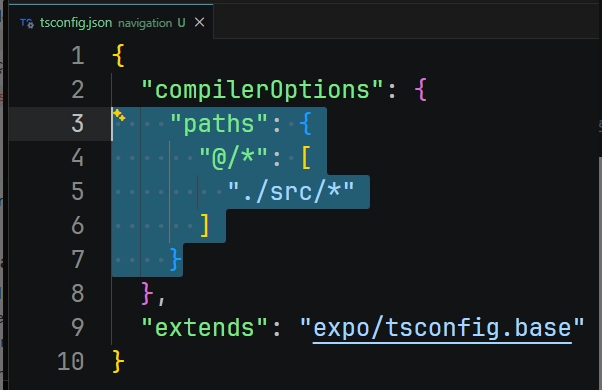

Vamos começar configurando nosso projeto no arquivo ``tsconfig.json``.

Dentro de ``compilerOptions``, vamos criar o ``paths``, responsável por criar atalhos de importação dentro do projeto.

O ``paths`` serve para evitar a necessidade de escrever caminhos longos e repetitivos nos imports.

Com ele, podemos utilizar atalhos como `@` para representar a pasta principal do projeto.


### Telas para o projeto

Para facilitar o entendimento, neste projeto não vamos nos preocupar em criar muitas funções ou separar excessivamente os arquivos. A ideia é criar o mínimo necessário para focarmos principalmente no funcionamento das navegações.

Note também que, neste projeto, os arquivos serão criados diretamente na pasta de funcionalidades, sem muitos diretórios separados.

Essa abordagem não está errada. Existem diferentes formas de estruturar um projeto React Native, e isso normalmente depende do tamanho da aplicação, da equipe e do padrão definido pela empresa em que estamos trabalhando.

para começar vamos criar nossa pagina inicial e os components desse projeto crie os arquivos da imagem

Cada arquivo vamos ter um código então segue o conteúdo de cada arquivo

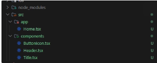


`Title.tsx`

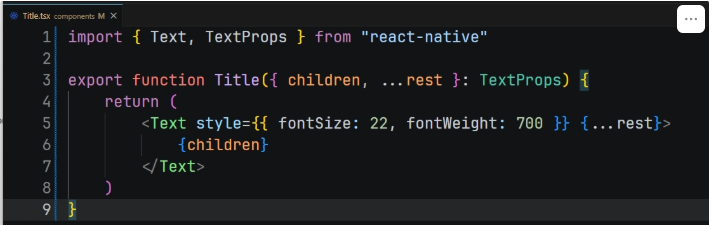


No React Native (e assim como no React para a web), **`children`** é uma propriedade (prop) automática e muito especial. Ela é usada para **passar componentes ou elementos visuais dentro de outro componente**, permitindo que você crie estruturas envelopadas (ou contêineres).

Pense no `children` como um "espaço reservado" (um buraco) que você deixa dentro do seu componente customizado, dizendo: *"O que for colocado aqui dentro quando me chamarem, vai renderizar nesse exato ponto"*.

`ButtonIcon.tsx`

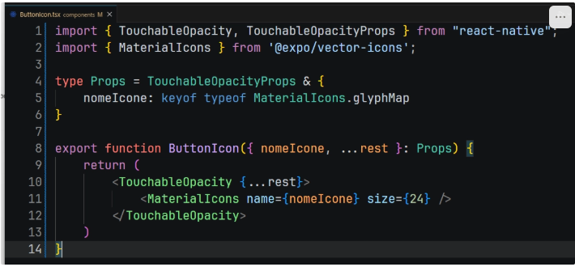


instale o pacote de ícones do expo (https://icons.expo.fyi/Index)

```powershell
npx expo install @expo/vector-icons
```

com o comando **`keyof typeof MaterialIcons.glyphMap`** eu estou fazendo um tipo de dados que só aceite um valor exato da lista de icones que contem no Material icons, no `@expo/vector-icons` todos os meteriais de icones tem a extensão `.glyphMap`

dica: passe o mouse em cima do comando ele vai mostrar todos os ícones possível da biblioteca

`Header.tsx` 

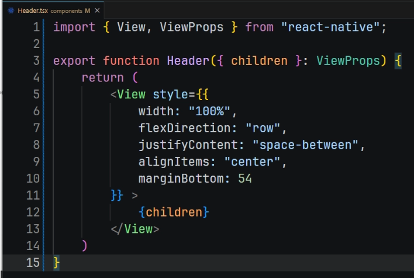


Agora na pasta `app/Home.tsx`

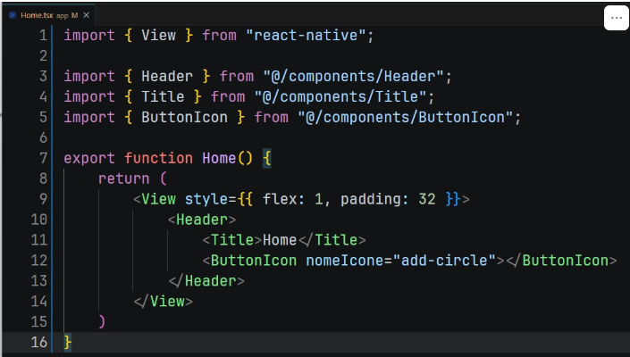


Note que como usamos o parâmetro `children` a gente passa o conteúdo que esta dentro das tag

Agora para a gente poder visualizar é preciso que nosso arquivo `App.tsx` chame a nossa pagina `Home` , dentro do arquivo pode apagar tudo e deixar somente:

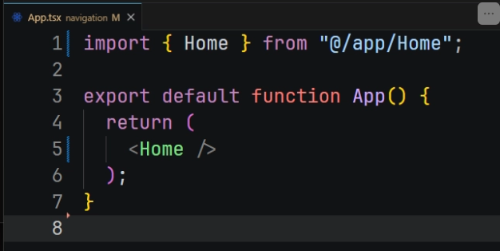


---

com isso feito termos a seguinte visualização.

Caso o `Header` fique muito colado na parte superior da tela no seu emulador, adicione um `paddingTop` no estilo da tela `Home`.

```tsx
<View style={{ 
	flex: 1, 
	padding: 32,
	paddinTop: 54 }}>
...
</View>
```

Vamos deixar o `paddingTop` temporariamente no projeto, pois o React Native já possui componentes próprios para trabalhar com a área segura da tela (*Safe Area*).

Esses componentes ajudam a evitar que o conteúdo fique sobreposto pela câmera, barra de status ou outros elementos do sistema do celular.

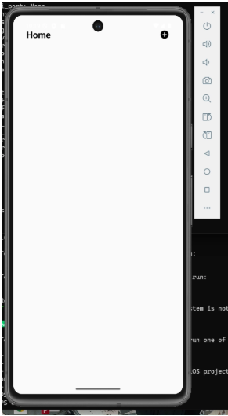


# Criando segunda tela do projeto `Produto.tsx`

aplique um `ctrl+c ctrl+v` no arquivo `Home.tsx`

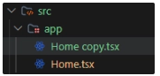


agora renomei o arquivo `Home copy.tsx` para `Produto.tsx` , logo em seguida faça as seguintes alterações

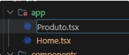


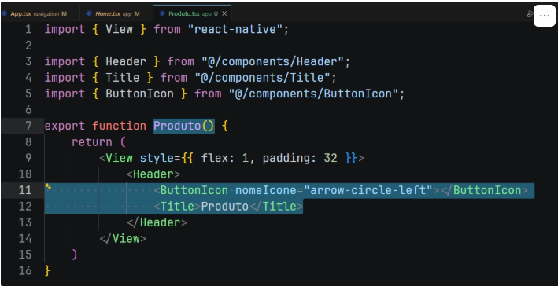


---

## Configurando o React Navigation

Todo este material está sendo baseado na documentação oficial do React Navigation. https://reactnavigation.org/docs/getting-started

Nesta primeira etapa, vamos instalar o núcleo principal (*core*) da biblioteca.

Essa instalação será a base para todo o sistema de navegação do projeto.

Após configurar o core, faremos a instalação do tipo de navegação que desejamos utilizar, como:

- Stack Navigation
- Tab Navigation
- Drawer Navigation

Pare a execução do projeto e vamos para a instalação

```powershell
npm install @react-navigation/native
```

O próximo passo é realizar a instalação das dependências necessárias para o funcionamento da navegação.

Sempre vamos utilizar as versões fornecidas pelo Expo, pois ele já realiza automaticamente a configuração das bibliotecas e instala versões compatíveis com o projeto.

```powershell
npx expo install react-native-screens react-native-safe-area-context
```

A biblioteca `react-native-screens` melhora o desempenho da navegação no aplicativo.

Ela faz com que as telas utilizem componentes nativos do Android e iOS, reduzindo o consumo de memória e deixando as transições mais rápidas e fluidas.

A biblioteca `react-native-safe-area-context` ajuda a trabalhar com as áreas seguras da tela (*Safe Area*).

Ela evita que conteúdos fiquem escondidos atrás de elementos do sistema do celular, como: câmera frontal, notch, barra de status, barra inferior de gestos

Agora vamos escolher qual abordagem vamos utilizar na navegação, lembrando que não é necessário instalar todas as abordagens de navegação apenas aquela abordagem que o seu projeto vai rodar

## Criando as rotas com Stack Navigation

para fazer a instalação dele rode:

```powershell
npm install @react-navigation/native-stack
```

A biblioteca ``@react-navigation/elements`` fornece componentes prontos que foram desenvolvidos para funcionar em conjunto com o React Navigation.

Neste projeto, vamos utilizar alguns componentes da biblioteca, como o `Button`, para auxiliar na construção das telas e exemplos de navegação.

```powershell
npm install @react-navigation/elements
```

após fazer a instalação rode o projeto novamente

```powershell
npx expo start
```

### Rotas da navegação

crie uma nova pasta da pasta `src` do seu projeto, e nomeei ela como `routes` , essa pasta vai ser responsável por guardar as rotas do projeto, dentro dela vamos criar um arquivo chamado `StackRoutes.tsx`

Por que trabalhar com arquivo de rotas? com esse arquivo podemos criar niveis de acesso para cada rota

Agora vamos criar nossa navegação utilizando o `Native Stack Navigator`.

O `createNativeStackNavigator()` é responsável por criar um sistema de navegação em pilha (*stack*), onde cada nova tela é aberta por cima da anterior.

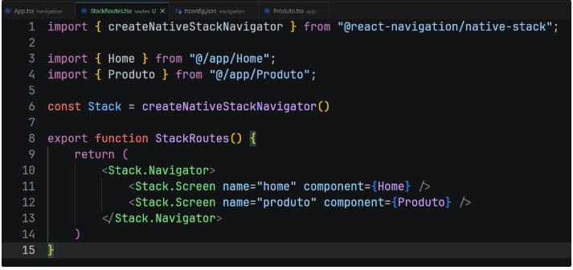

```tsx
const Stack = createNativeStackNavigator();
```

Cria o objeto responsável pela navegação em pilha do aplicativo.

É através dele que teremos acesso aos componentes:

- `Stack.Navigator`
- `Stack.Screen`

### Stack.Navigator

```tsx
<Stack.Navigator>
```

O `Stack.Navigator` funciona como o container principal das rotas.

Todas as telas que fizerem parte dessa navegação devem ficar dentro dele.

---

### Stack.Screen

```tsx
<Stack.Screen name="home" component={Home} />
```

O `Stack.Screen` representa uma tela da aplicação.

Ele possui algumas propriedades importantes:

- `name`
    
    Nome da rota utilizado para navegação.
    
- `component`
    
    Componente React que será exibido quando a rota for acessada.
    

Vamos agora criar o core de navegação do nosso projeto, ele que vai ser responsavel por ‘devolver’ nossas rotas

dentro da pasta routes crie um arquivo `index.tsx`  e faça o seguinte codigo

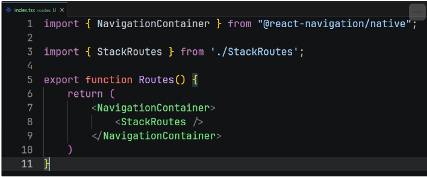

agora vai ser preciso a gente fazer o render das rotas, trocando ele no nosso arquivo App.tsx , mude a exportação do Home para Routes

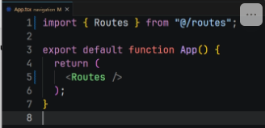

logo em seguida abra o seu projeto, seu projeto vai mudar ele vai criar um novo header com a escrita da rota

Detalhe importante nesse primeiro momento as rotas é por ondem de declaração então se você for no arquivo `StackRoutes.tsx` e mudar a ordem da declaração de rotas ele vai carregar sempre a primeira rota

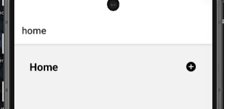